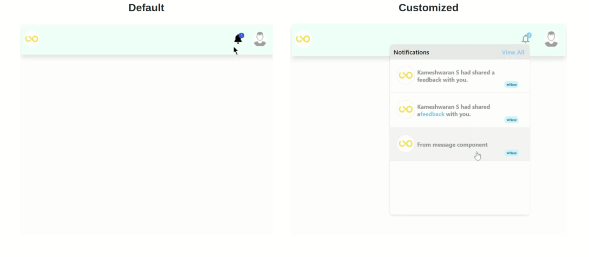

# notifications-menu-react

> A React Component used to render notifications with default styles and also allows to customize entire notification component
> by providing necessary props and styles.

[](https://www.npmjs.com/package/react-notifications-menu) [](https://standardjs.com)

<p align="center">

</p>

## Getting Started

### Install

Install using npm or yarn

```bash
npm install --save notifications-menu-react-gj
```

or

```bash
yarn add --save notifications-menu-react-gj
```

## Basic Usage

```jsx
import Notifications from "notifications-menu-react";

const Example = () => {
  return (
    <Notifications
      renderItem={CustomComponent}
      classNamePrefix='okrjoy'
      headerBackgroundColor='red'
    />
  );
};
```

To know more, visit [react-notifications-menu](https://react-notifications-menu.netlify.com/) docs

## Demo

To view the demo of the Notification component in the code sandbox. Click <a style="color:#cc3a38" href="https://codesandbox.io/s/strange-forest-1kwtb?file=/src/App.js">here</a>.
